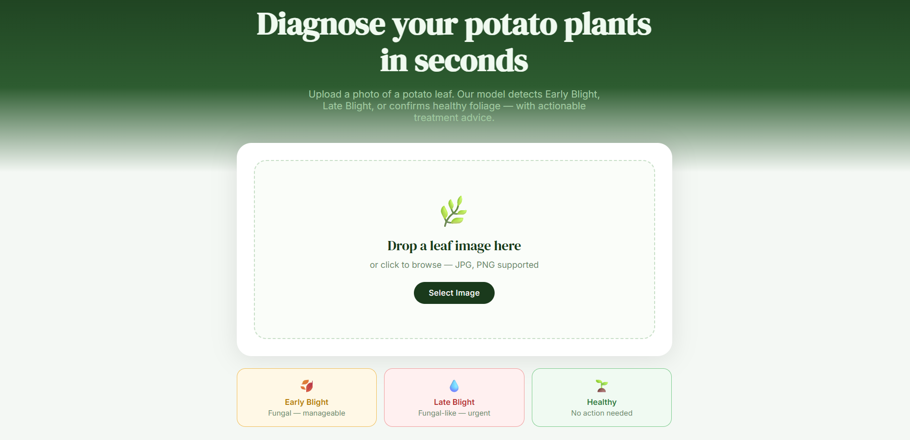
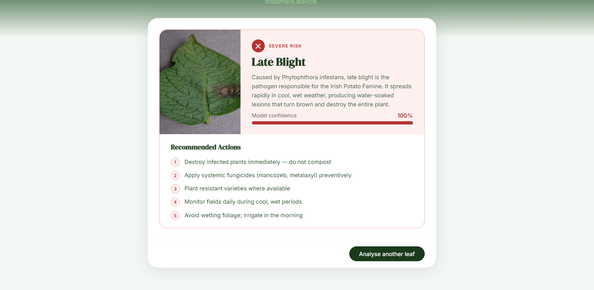

# 🥔 PotatoGuard — Potato Disease Detection

   

A full-stack web app that detects potato leaf diseases from images using a CNN trained on the PlantVillage dataset.




## Features
- Drag-and-drop leaf image upload
- Detects **Early Blight**, **Late Blight**, and **Healthy**
- Shows confidence score and treatment recommendations

## Tech Stack
| | |
|---|---|
| Frontend | React, Vite |
| Backend | FastAPI, Python |
| Model | TensorFlow, Keras |

## Setup

### 1. Clone
```bash
git clone https://github.com/FatimaHabib191/PotatoGuard.git
cd PotatoGuard
```

### 2. Train the model
Run `training/model.ipynb` to generate `saved_models/1.keras`

### 3. Backend
```bash
cd api
pip install -r requirements.txt
uvicorn main:app --reload
```
Runs at `http://localhost:8000`

### 4. Frontend
```bash
cd potato-frontend
npm install
npm run dev
```
Runs at `http://localhost:5173`

## API
`POST /predict` — upload a leaf image, returns:
```json
{ "class": "Potato___Late_blight", "confidence": 0.99 }
```
